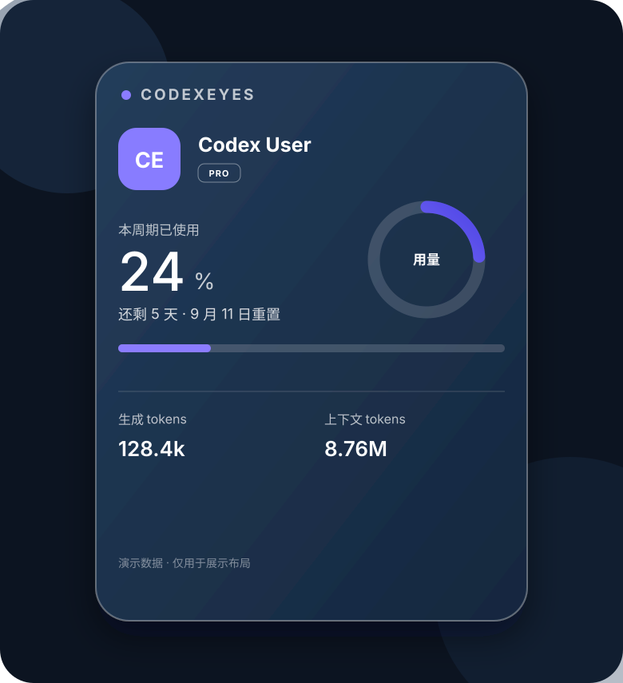

# codexeyes

> 在 macOS 或 Windows 桌面上，随时查看 Codex 用量。

[](https://www.apple.com/macos/)
[](https://www.microsoft.com/windows/)
[](LICENSE)
[](native/)



演示图中的账号、百分比和 Token 数字都是虚构的，只用于展示布局。真实运行时，组件只显示你本机 Codex 账号的数据。

## 它能做什么

codexeyes 是一个原生桌面小组件。它不需要打开 Codex 窗口，也不依赖浏览器或 WebView：

- 显示当前登录账号、头像和套餐类型
- 显示本周期用量、剩余时间、生成 Token 和上下文 Token
- Codex 记录变化时自动更新，每 30 秒做一次兜底检查
- 卡片可以拖动，位置会保存在本机
- 使用紧凑的半透明深色布局，白色文字在桌面上清晰可读

它适合经常使用 Codex CLI、需要控制额度的开发者，也适合希望少开一个窗口的日常用户。

## 选择你的系统

| 系统 | 实现 | 快速入口 |
| --- | --- | --- |
| macOS 13+ | SwiftUI + AppKit | [`native/`](native/) |
| Windows 10/11 | WPF + .NET 8 | [`windows/`](windows/) |

## macOS 安装

先安装并登录 [Codex CLI](https://github.com/openai/codex)，然后在终端执行：

```bash
git clone https://github.com/xinzhang007/codexeyes.git
cd codexeyes
./native/install.sh
```

脚本会把应用放入 `/Applications/codexeyes.app`，设置登录 macOS 后自动显示。桌面不会额外出现应用图标。

现成的应用包适合 Apple Silicon Mac。Intel Mac，或希望从源码重新编译时，执行：

```bash
./native/build.sh
./native/install.sh
```

需要 macOS 13 或更高版本，以及 Xcode Command Line Tools（提供 `swiftc`）。本项目没有使用 Apple Developer 签名；如果系统提示未验证开发者，请在“应用程序”文件夹中右键点击 `codexeyes`，选择“打开”。


## Windows 安装

Windows 版本是原生 WPF 应用。需要 Windows 10/11 和 .NET 8 SDK（只在构建时需要）。在 PowerShell 中从仓库根目录执行：

```powershell
.\windows\install.ps1
```

脚本会发布自包含的 `win-x64` 单文件程序，创建 Windows 启动文件夹快捷方式，然后启动组件。桌面不会创建快捷方式。

ARM64 Windows 设备：

```powershell
.\windows\install.ps1 -Runtime win-arm64
```

如果 PowerShell 阻止脚本运行，可以只对当前窗口放宽限制：

```powershell
Set-ExecutionPolicy -Scope Process Bypass
```

重新构建：

```powershell
.\windows\build.ps1
```

卸载并取消开机启动：

```powershell
.\windows\uninstall.ps1
```

Windows 版本默认显示在当前虚拟桌面，窗口始终置顶并隐藏任务栏图标。拖动卡片可调整位置，点击用量区域可复制摘要。

## 第一次打开后看不到数据？

codexeyes 不生成或猜测用量，它读取 Codex CLI 已经写入本机的记录。请按下面顺序检查：

1. 在终端或 PowerShell 运行一次 `codex`，确认已经登录并完成一次请求。
2. 确认本机存在对应文件：
   - macOS：`~/.codex/auth.json` 和 `~/.codex/sessions/`
   - Windows：`%USERPROFILE%\\.codex\\auth.json` 和 `%USERPROFILE%\\.codex\\sessions\\`
3. 重新打开组件。

如果仍显示“等待 Codex 数据”，通常表示 Codex CLI 尚未写入可用的额度记录。

## 日常使用

- 悬停在用量区域，可以查看当前额度窗口的补充信息。
- 点击用量区域，可以复制一行摘要，粘贴到 issue 或团队聊天中。
- 不需要手动刷新。文件监听和 30 秒兜底计时器会自动更新。
- 额度达到 80% 或 95% 时，进度条和环形图会切换为预警色。

## 隐私与安全

用量和账号信息只在本机读取，用于渲染桌面面板。应用不会把用量、账号姓名或邮箱上传到本项目或其他服务。若登录凭据提供头像地址，应用仅按该地址加载头像；用量数据本身不会通过网络发送。

仓库不包含登录凭据、会话日志、账号姓名、邮箱或本机路径。读取逻辑可以直接查看：

- [macOS 源码](native/Sources/CodexEyesApp.swift)
- [Windows 源码](windows/MainWindow.xaml.cs)

## 面向开发者

```text
app/                    已构建的 macOS 应用包
demo/                   不含真实账号信息的演示图
native/Sources/         macOS SwiftUI/AppKit 源码
native/build.sh         macOS 构建脚本
native/install.sh       macOS 安装与登录启动脚本
windows/                Windows WPF 源码与 PowerShell 脚本
manifest.json           桌面组件元数据
```

修改源码后，在对应系统运行构建和安装脚本。欢迎提交 Issue 或 Pull Request；提交前请确认没有把 `~/.codex` 或 `%USERPROFILE%\\.codex` 下的文件、截图或日志复制到仓库。

## 卸载 macOS 版本

```bash
launchctl bootout "gui/$(id -u)/local.codex.eyes" 2>/dev/null || true
rm -f "$HOME/Library/LaunchAgents/local.codex.eyes.plist"
rm -rf /Applications/codexeyes.app
```

## 许可证

本项目使用 [MIT License](LICENSE)。

## English quick start

`codexeyes` is a native desktop usage widget for Codex CLI on macOS and Windows. It reads usage records locally, refreshes automatically, and keeps a compact always-visible card on your desktop.

- macOS: run `./native/install.sh`
- Windows: run `.\windows\install.ps1` in PowerShell
- Source, privacy notes, and uninstall steps are documented above.

The demo image uses sample data. The app never needs your Codex session files in the repository.
